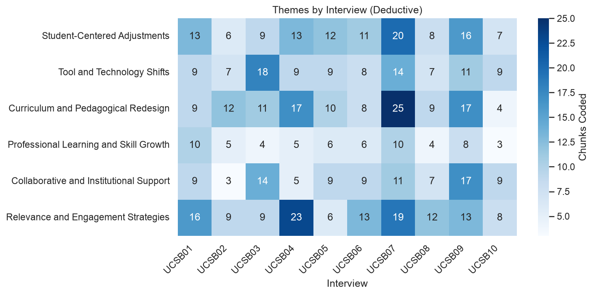
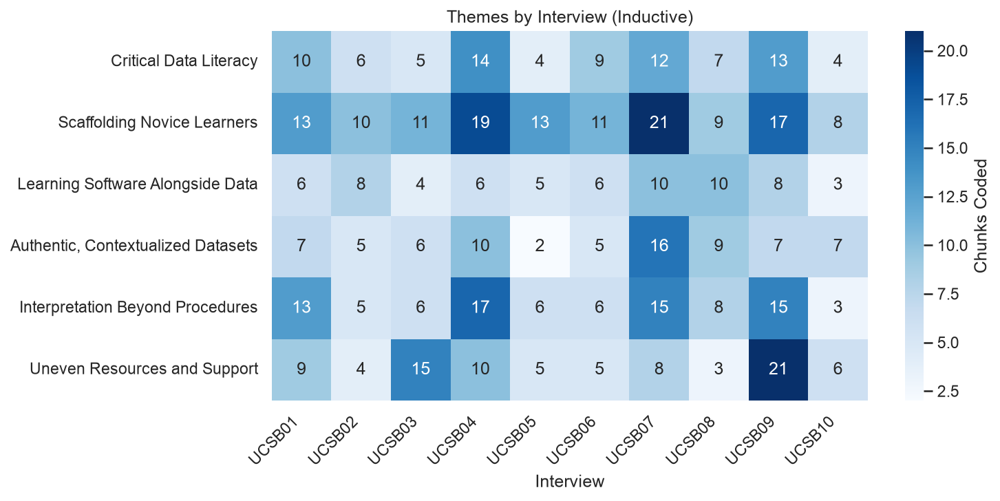

# Using LLMs in Qualitative Research

[](https://colab.research.google.com/github/UnitForDataScience/Prompting-Qual-Insight/blob/main/Prompting_Qualitative_Insight.ipynb)

A hands-on workshop notebook for using large language models (LLMs) to analyze interview transcripts. You will explore 10 interviews with university instructors, then run deductive and inductive thematic coding with the OpenAI API, and export the results as coding matrices you can review, edit and compare with human coding.

No local installation is needed. Everything runs in Google Colab.

## What the notebook covers

| Section | What you do |
|---|---|
| Set up | Install libraries, load your API key from Colab Secrets, choose a model |
| Make a request | Send a first prompt to the model |
| Load interview data | Load the 10 workshop interviews from this repo (or upload your own) and ask the model questions about them |
| Exploratory data analysis | Document lengths, word cloud, word frequencies, TF-IDF, a PCA map of interviews, and LLM-generated topic labels |
| Deductive thematic analysis | Code every instructor response against a predefined codebook (0/1 per theme) |
| Inductive thematic analysis | Let the model propose themes from all transcripts, then code every response against them |
| Download results | Download everything in `outputs/` as one zip file |

Both coding sections produce a coding matrix (one row per response, one column per theme), theme counts per interview, a bar chart and a heatmap.

## Repository contents

```
Prompting_Qualitative_Insight.ipynb   workshop notebook
data/                 10 de-identified interview transcripts (UCSB01.pdf ... UCSB10.pdf)
outputs/              results from a full run of the notebook, for reference
```

## During the workshop

You will need a Google account to work on Google Colab. It is free and incredibly user-friendly. We will provide an API key you can use during the workshop.

**1. Open the notebook and save your own copy**

1. Click the **Open in Colab** badge above.
2. In Colab, go to **File → Save a copy in Drive**. Work in your copy, not the original.

**2. Copy the API Key**
1. Click on the "API Key.pdf" file above.
2. Download the file to your computer, open it, and copy the key.
3. When running the notebook, you will be asked to provide your API key, pastes and press "enter/return"

### Data

The workshop uses 10 de-identified, semi-structured interviews with instructors who teach undergraduates with quantitative data in the social sciences at the University of California, Santa Barbara. They were collected by UCSB Library as part of the Ithaka S+R project *Teaching with Data in the Social Sciences*. Participants are identified only by ID (UCSB01 to UCSB10), and disciplines and course topics are redacted.

The transcripts are published openly on Dryad:

> Curty, Renata Gonçalves; Greer, Rebecca; White, Torin (2024). *Teaching undergraduates with quantitative data in the social sciences at University of California Santa Barbara* [Dataset]. Dryad. https://doi.org/10.25349/D9402J

The deductive codebook in the notebook is written for this research question:

> How do university instructors adapt their data-teaching practices to meet diverse student needs and evolving technological and institutional contexts?


## How the coding works

Both thematic analysis sections follow the same pipeline:

```
10 transcripts (PDF)
  → extract text and collapse whitespace
  → split on speaker labels, keep instructor turns longer than 80 characters (323 responses)
  → send each response to the model with the themes, get back JSON (1 = present, 0 = absent)
  → combine into a coding matrix, count themes per interview, plot
```

The inductive section adds one step at the start: the model reads all 10 transcripts and proposes the themes first. Requests are sent 8 at a time, so each coding pass takes 2 to 3 minutes.

### Deductive prompt

The codebook is defined in the notebook:

```python
codes = [
    "Student-Centered Adjustments",
    "Tool and Technology Shifts",
    "Curriculum and Pedagogical Redesign",
    "Professional Learning and Skill Growth",
    "Collaborative and Institutional Support",
    "Relevance and Engagement Strategies"
]
```

Each instructor response is sent with this prompt:

```
Read the passage and decide whether each of {len(codes)} themes appears.
Return ONLY valid JSON with each key = theme and value = 1 (present) or 0 (absent).
Themes: {', '.join(codes)}
Passage: """{response}"""
```

### Inductive prompts

First pass, run once on all transcripts:

```
Read following transcripts and list 5-6 inductive themes that best capture recurring ideas across interviews.
Give each theme a short label of 2-6 words.
Return ONLY valid JSON in this format:
{"themes":["theme1","theme2","theme3",...]}
Transcripts:
"""{all transcripts}"""
```

Second pass, run on each instructor response:

```
Determine whether each of the following themes appears in this passage.
Return ONLY valid JSON with each theme as key and 1 (present) or 0 (absent) as value.

Themes: {', '.join(themes)}

Passage:
"""{response}"""
```

### Output formats

Every coding request uses the API's JSON mode (`text={"format": {"type": "json_object"}}`), so the model always returns parseable JSON. A response for one passage looks like this:

```json
{
  "Student-Centered Adjustments": 1,
  "Tool and Technology Shifts": 1,
  "Curriculum and Pedagogical Redesign": 0,
  "Professional Learning and Skill Growth": 0,
  "Collaborative and Institutional Support": 0,
  "Relevance and Engagement Strategies": 1
}
```

If a response can't be parsed, that passage's themes are left blank rather than guessed.

The coding matrices have one row per instructor response:

| Column | Content |
|---|---|
| `interview` | Interview ID, e.g. `UCSB01` |
| `chunk_id` | Response number within the interview, starting at 1 |
| one column per theme | `1` present, `0` absent, blank if parsing failed |
| `chunk_preview` | First 220 characters of the response, for checking the coding by eye |

## Example outputs

The `outputs/` folder holds the results of one full run of the notebook on the 10 workshop interviews, so you can see what to expect before running it yourself. Your results will differ slightly, because model output varies between runs, and the inductive themes can change completely.

| File | Content |
|---|---|
| `document_stats.csv` | Word count, character count and average word length per interview |
| `gpt_topics.csv` | 3-5 topic keywords per interview, generated by the model |
| `deductive_coding_matrix.csv` | Deductive codes for all 323 instructor responses |
| `deductive_themes_by_interview.csv` | Number of responses coded with each deductive theme, per interview |
| `inductive_themes.json` | Themes the model proposed from the transcripts |
| `inductive_coding_matrix.csv` | Inductive codes for all 323 instructor responses |
| `inductive_themes_by_interview.csv` | Number of responses coded with each inductive theme, per interview |
| `*.png` | All charts from the notebook |





## Interpreting results

LLM coding is a starting point for analysis, not a replacement for it. Models can miss nuance, over-apply themes and give different answers on repeated runs. Treat the coding matrices as a first pass: read the coded passages, compare them with your own coding, and document how you used the model in your methods section.

## After the workshop
and an OpenAI API key with a small amount of credit.

**1. Create an OpenAI API key**

1. Sign in at [platform.openai.com](https://platform.openai.com).
2. Add a payment method under Billing. A few dollars of credit is enough for the workshop.
3. Go to API keys and create a new secret key. Copy it. You will not be able to see it again.

**2. Add your key to Colab Secrets**

1. In your copy, click the key icon in the left sidebar.
2. Click **Add new secret**.
3. Name it exactly `OPENAI_API_KEY` and paste your key as the value.
4. Turn on **Notebook access**.

The notebook reads the key with `userdata.get("OPENAI_API_KEY")`, so it never appears in your code or outputs. Never save your key into a notebook cell or share it in chat.

### Adapting the notebook

- **Model:** change `MODEL` in the "Choose Model and Connect to API" cell. Every later cell uses it.
- **Codebook:** edit the `codes` list in the deductive analysis cell to match your research question.
- **Prompts:** the coding prompts are plain text inside each cell and are meant to be edited.
- **Number of inductive themes:** change "5-6" in `overview_prompt`.

### Using your own transcripts

In the "Load Interview Data" cell, comment out option 1 and uncomment option 2 to upload your own PDF or TXT files. Each turn should start with a speaker label:

```
I: Can you tell me about the course you teach?
UCSB01: Sure. I teach an introductory data course for about two hundred students...
```

`I:` marks the interviewer and `UCSB01:`, `UCSB02:` and so on mark participants. Only participant turns are coded. If your transcripts use different labels, edit the speaker pattern in the "define themes" cell:

```python
parts = re.split(r"(\bI\s*:|\b(?i:UCSB)\s*\d*\s*:)", text)
```


### Time and cost

A full run of the notebook on the 10 interviews takes about 8 minutes and makes about 670 API calls. With the default model, `gpt-6-luna`, OpenAI's lowest-cost current model, it costs well under one US dollar. Larger models cost more. Check [OpenAI pricing](https://openai.com/api/pricing) before switching.

### Data privacy

Text sent to the API leaves your computer and is processed by OpenAI. Before using your own interview data:

- Check that your consent forms and IRB or ethics approval permit sharing transcripts with a third-party service.
- Remove or pseudonymize names and other identifying details.
- Review OpenAI's [data usage policy](https://openai.com/policies/api-data-usage-policies). By default, API data is not used to train models.

### Troubleshooting

| Problem | Fix |
|---|---|
| `SecretNotFoundError` | The secret must be named exactly `OPENAI_API_KEY`, with Notebook access turned on. |
| `AuthenticationError` / 401 | The key is wrong or was revoked. Create a new one and update the secret. |
| `RateLimitError` / 429 | Your account has no credit left, or you hit a rate limit. Add credit or wait a minute. |
| `NotFoundError` for the model | The model name has changed or been retired. Set `MODEL` to a current model from the [OpenAI models page](https://developers.openai.com/api/docs/models). |
| "Found 0 interview files" | The repo didn't download. Rerun the "Load Interview Data" cell, or upload the files with option 2. |
| "keeping 0 instructor responses" | Your transcripts' speaker labels don't match the pattern. See [Using your own transcripts](#using-your-own-transcripts). |
| Upload dialog does nothing | Run the cell again and make sure your browser allows pop-ups for Colab. |
